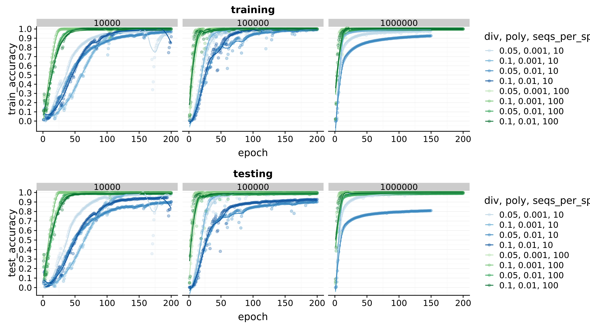

MycoNet
=======

Small toolkit for classifying DNA/ITS sequences using k-mer/recoding,
an embedding layer and a BiLSTM.

**Quickstart**
- **Create environment & install dependencies** (recommended):

```bash
pip install uv
uv install
```

- **Train** a tiny model (CLI):

```bash
python train.py path/to/input.fasta experiment_name 10 --epochs 50 --batch-size 256
```

- **Predict** using a trained experiment:

```bash
python predict.py queries.fasta experiment_name results.csv
```

Input format
- Files expect alternating header and sequence lines (header on one line,
	sequence on the next). Sequences should be long enough to pass configured
	filtering (`--minseq`, default 100).

Model formats
- Training saves a single-file Keras archive (`.keras`) and also attempts to
	export a TensorFlow SavedModel directory. The code prefers the `.keras`
	archive for reload with Keras 3. `predict.py` will load a `.keras` file if
	present, or wrap a SavedModel directory with `TFSMLayer` for inference.

Tests
- Run the full test suite with:

```bash
pytest -q
```

- Tests live under `tests/`. `tests/conftest.py` ensures the repo root is on
	`sys.path` and includes a cleanup fixture that removes temporary
	`small_test*` directories after the session.

Repository layout
- `MycoNet/` — package modules (`recode.py`, `make_model.py`, `kmer_embedding.py`, `data.py`, `utils.py`).
- `train.py` — promoted training CLI (canonical training entrypoint).
- `predict.py` — prediction script (loads `.keras` or SavedModel dirs).
- `tests/` — pytest tests and fixtures.

Notes
- Tested on Python 3.12 with TensorFlow/Keras; GPU usage is optional and
	TensorFlow will try to enable memory growth when GPUs are available.

**Performance** on simulated data:


